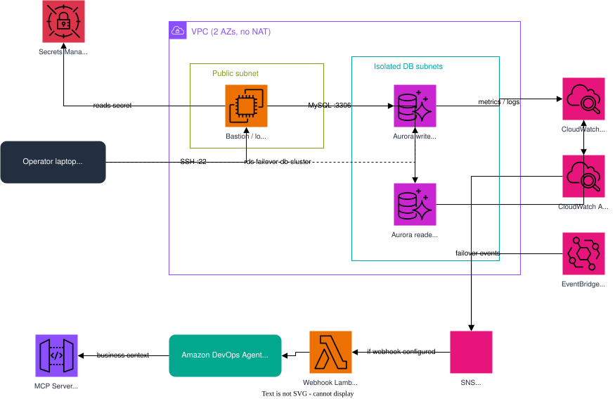

# Intelligent Aurora MySQL Incident Investigation with AWS DevOps Agent
*Your database degrades at 2 AM — instead of an on-call engineer digging through Performance Insights and error logs for 45 minutes, Amazon DevOps Agent investigates automatically, finds root cause, and quantifies the business impact.*

## Overview

Automated root-cause analysis for Amazon Aurora MySQL incidents. When a CloudWatch alarm fires (or a failover event occurs), an SNS → Lambda webhook notifies **Amazon DevOps Agent**, which reads CloudWatch metrics, Performance Insights, and the Aurora error/slow-query logs, correlates the signals, and enriches the finding with business context (dependent services, revenue-per-minute, compliance deadlines) via an **MCP server**. The result is an actionable incident report — not a wall of raw logs.

This is the database sibling to the EKS and Site-to-Site VPN DevOps Agent investigation demos.

## DevOps Agent Features Demonstrated

| Feature | How it's shown |
|---------|----------------|
| **Automated incident investigation** | Inject a failure → a CloudWatch alarm fires → the agent opens and runs an investigation on its own, no prompting |
| **On-demand chat** | Ask the agent about the cluster in the Operator App → it queries CloudWatch + RDS and returns a structured root-cause report |
| **Business-context enrichment (MCP)** | The agent calls an MCP server for dependencies, revenue-per-minute impact, and compliance deadlines — context it can't get from metrics alone |
| **Multiple incident types** | Four reliable scenarios — connection storm, CPU spike, deadlock, failover — each mapped to its own alarm/event |

## At a Glance
- **Duration**: ~25 minutes (Agent Space setup + infra deployment; Aurora cluster creation is ~10-15 min of that)
- **Difficulty**: Intermediate
- **Target Audience**: DBREs, SREs, Cloud Operations, TAMs running database-focused customer conversations
- **Key Technologies**: Amazon Aurora MySQL, CloudWatch, Performance Insights, SNS, Lambda, EventBridge, CDK (Python), Amazon DevOps Agent, MCP
- **Estimated Cost**: ~$0.55–0.90/hr while running; tear down with `cleanup` when done. See [Cost & Cleanup](#cost--cleanup).

## Business Value

Database incidents are high-stakes and time-sensitive: a stalled writer blocks checkout, a connection storm takes down every dependent service, and a replica-lag spike quietly serves stale data. Mean-time-to-resolution is dominated by *triage* — figuring out *what* broke and *who* it affects. This demo shows how DevOps Agent collapses that triage from tens of minutes of manual log-reading into an automated, business-aware investigation, so engineers act on conclusions instead of assembling them.

## What You'll See

1. A healthy Aurora MySQL cluster (writer + reader) with CloudWatch alarms in OK state.
2. Inject a realistic failure with one command (e.g. a connection storm).
3. A CloudWatch alarm transitions to ALARM → SNS → Lambda webhook → DevOps Agent.
4. DevOps Agent opens an investigation on its own, reads metrics + logs, and identifies root cause.
5. The agent queries the MCP server for business context: dependent services, $/minute impact, compliance reporting deadlines, and recent changes.
6. A complete incident report, plus on-demand follow-up chat ("what are the remediation steps?").

## How Incident Detection Works

```
Inject a failure (e.g. connection storm)
        │
        ▼
Aurora metric breaches → CloudWatch Alarm fires (ALARM)
        │   (RDS failover uses an EventBridge rule instead of a metric alarm)
        ▼
SNS topic (aurora-demo-alarm) notifies the webhook Lambda
        │
        ▼
Lambda signs the payload (HMAC-SHA256) → calls the DevOps Agent webhook
        │
        ▼
DevOps Agent investigates: CloudWatch metrics, Performance Insights, Aurora logs
        │
        ▼
Root cause + business context (via MCP) delivered — no human in the loop
```

## Prerequisites
- AWS CLI v2.31+ configured with credentials
- Node.js 20+ and Python 3.9+ (for CDK)
- An EC2 key pair in the target region
- OpenSSH client (`ssh`/`scp`) — preinstalled on macOS/Linux and Windows 10+
- Amazon DevOps Agent access in your account/region
- **CDK bootstrap** — the target account/region must be bootstrapped once: `npx cdk bootstrap aws://<account-id>/<region>`
- **DevOps Agent region** — the Agent Space is created in your deploy region. `AWS::DevOpsAgent` isn't available everywhere, so use a supported region (e.g. `us-west-2`, `us-east-1`)

## Deployment (Quick Start)

Two commands. Step 1 configures Amazon DevOps Agent; step 2 deploys the Aurora
environment and automatically picks up the webhook from step 1.

### 1. Set up the DevOps Agent (hands-free)
```bash
bash scripts/setup-devops-agent.sh us-west-2          # macOS/Linux
# ./scripts/setup-devops-agent.ps1 -Region us-west-2   # Windows
```
This **creates (or reuses) everything automatically** via the AWS SDK — no console
clicking:
- an Agent Space named `aurora-demo`
- the two required IAM roles (monitoring + operator)
- the Operator App (web console access)
- your AWS account connected as a monitored cloud source
- a generic HMAC **webhook**, whose URL + secret are saved to `.devops-agent.env`

Add `--with-mcp` (`-WithMcp` on Windows) to also deploy and print the MCP
business-context server registration details.

> If your AWS SDK build predates the DevOps Agent API, the script detects that and
> prints the one-time console steps instead — the rest of the demo is unchanged.

### 2. Deploy the Aurora demo
```bash
# macOS / Linux — auto-loads the webhook from .devops-agent.env
bash deploy-all.sh --key-file ~/.ssh/your-key.pem
```
```powershell
# Windows
./deploy-all.ps1 -KeyFile "$HOME\.ssh\your-key.pem"
```
You don't need to copy/paste the webhook — `deploy-all` reads `.devops-agent.env`
automatically. (You can still pass `--webhook-url` / `--webhook-secret` explicitly,
or omit step 1 entirely to run the environment without agent notifications and just
watch alarms + Performance Insights.)

## Running Scenarios
```bash
# Inject
bash scripts/inject-failure.sh connection-storm --key-file ~/.ssh/your-key.pem

# Roll back
bash scripts/inject-failure.sh connection-storm --key-file ~/.ssh/your-key.pem --rollback

# Status (injections + alarm states)
bash scripts/inject-failure.sh status --key-file ~/.ssh/your-key.pem
```

## Watching the Investigation

Open your Agent Space in the Amazon DevOps Agent console (same region you deployed in):
```
https://<region>.console.aws.amazon.com/aidevops/home?region=<region>
```
Select the `aurora-demo` space. After you inject a scenario, the alarm → webhook path
opens a new investigation **automatically** within 1–3 minutes (titled
`ALARM: "aurora-demo-…" in <Region>`) — click into it to watch the agent read the
metrics, correlate signals, and produce a root-cause report with no prompting.

You can also start an investigation **on demand** from the Agent chat, e.g.:

> Investigate the Amazon Aurora MySQL cluster `aurora-demo-cluster` in `<region>`. The
> `aurora-demo-connections-high` alarm is firing on the writer `aurora-demo-writer`.
> Find the root cause and recommend remediation.

Tip: CloudWatch metrics lag ~2–3 minutes, so give an active incident a moment before
asking the agent to investigate (or ask it to "re-check" to pick up the peak).

## Run the Demo

A suggested walkthrough:

1. **Show a healthy cluster** — open the DevOps Agent console + CloudWatch Alarms; all `aurora-demo-*` alarms are OK.
2. **Inject an incident** — e.g. `bash scripts/inject-failure.sh connection-storm --key-file ~/.ssh/your-key.pem` (see [Running Scenarios](#running-scenarios)).
3. **Watch the alarm fire** — the matching alarm flips to ALARM in ~1–3 min.
4. **Watch the agent investigate** — a new investigation appears in the Agent Space on its own (see [Watching the Investigation](#watching-the-investigation)); open it to see the root-cause reasoning and MCP business context.
5. **Roll back** — re-run the inject with `--rollback`; the alarm returns to OK.

Recommended scenarios for a live demo: **connection-storm, cpu-spike, deadlock, failover** — the four most reliable.

## Failure Scenarios

| Scenario | What it does | Signal / Alarm |
|----------|--------------|----------------|
| `connection-storm` | Opens ~200 held connections on the writer | `DatabaseConnections` high → `aurora-demo-connections-high` |
| `cpu-spike` | Runs CPU-burn query workers | `CPUUtilization` high → `aurora-demo-cpu-high` |
| `deadlock` | Two transactions lock rows in opposite order | InnoDB `Deadlocks` → `aurora-demo-deadlocks` |
| `failover` | `aws rds failover-db-cluster` — swaps writer/reader | RDS failover event via EventBridge → SNS |
| `memory-pressure` | Large sorts / temp tables (best-effort) | `FreeableMemory` low → `aurora-demo-memory-pressure` *(dedicated)* |
| `replica-lag` | Heavy write churn (best-effort) | `AuroraReplicaLag` high → `aurora-demo-replica-lag` *(dedicated)* |

Dedicated alarms start with their actions disabled; the inject script enables them before injecting and disables them on rollback (so they only fire for their scenario). `memory-pressure` and `replica-lag` are best-effort (harder to force on a larger instance) — the four core scenarios are the most demo-reliable.

## MCP Server Tools

| Tool | Input | Returns |
|------|-------|---------|
| `get_service_dependencies` | resource_id | Dependent services + criticality, on-call team, ~18K users affected |
| `get_cost_impact` | resource_id, downtime_minutes | Revenue loss ($5,100/min), orders/min, SLA breach status |
| `get_compliance_status` | resource_id | PCI-DSS / SOC 2 / GDPR reporting thresholds, data classification |
| `get_maintenance_context` | resource_id | Recent parameter/app/engine changes to correlate with the incident |

## Architecture



- **Network**: an Aurora MySQL cluster (writer + reader) sits in isolated subnets; a public bastion/load-generator injects scenarios over the MySQL protocol. No NAT gateway (cost).
- **Detection**: CloudWatch alarms (connections, CPU, deadlocks, memory, replica-lag) plus an EventBridge failover rule fan into a single SNS topic.
- **Investigation**: a conditional webhook Lambda notifies Amazon DevOps Agent, which reads CloudWatch metrics, Performance Insights, and Aurora logs, then queries an MCP server (API Gateway + Lambda) for business context (dependencies, cost impact, compliance).

See [ARCHITECTURE.md](ARCHITECTURE.md) for the full component breakdown and Well-Architected design notes.

## Cost & Cleanup

Tear everything down when finished:
```bash
bash scripts/cleanup.sh us-west-2     # macOS/Linux
# ./scripts/cleanup.ps1 -Region us-west-2               # Windows
```
Cleanup destroys the CDK stacks **and** removes the Agent Space + IAM roles that
`setup-devops-agent` created. If you deployed the MCP server, remove its
registration in the DevOps Agent console as well.

## Security Notes (demo-grade)

- The bastion is internet-facing on port 22; `deploy-all` restricts SSH to your current IP by default (`--ssh-open` widens it — avoid outside a demo).
- The Aurora cluster is **not** publicly accessible, is encrypted at rest, and only accepts MySQL from the bastion security group.
- Master credentials are generated into AWS Secrets Manager; the bastion reads them via an instance role. No passwords are stored in code or on disk.

## Contributing

We welcome community contributions! Please see [CONTRIBUTING.md](../../CONTRIBUTING.md) for guidelines.

## Security

See [CONTRIBUTING](../../CONTRIBUTING.md#security-issue-notifications) for more information.

## License

This library is licensed under the MIT-0 License. See the [LICENSE](../../LICENSE) file.
