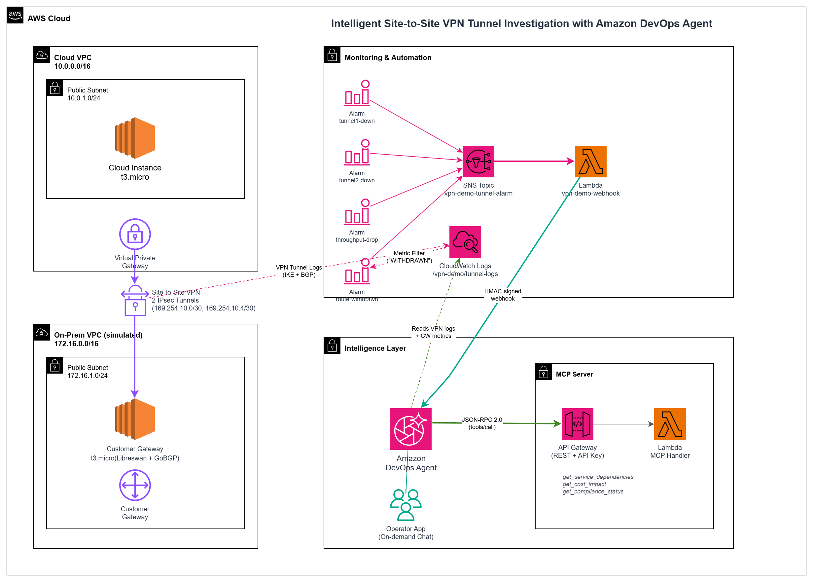

# Intelligent Site-to-Site VPN Tunnel Investigation with Amazon DevOps Agent

*Automated root-cause analysis and business-context enrichment for AWS Site-to-Site VPN tunnel failures — powered by Amazon DevOps Agent.*

## Overview

AWS Site-to-Site VPN tunnels fail for dozens of reasons — pre-shared key mismatches, IKE proposal incompatibilities, dead-peer-detection timeouts, BGP session drops, BGP route withdrawals, and subtle throughput degradation. When a tunnel goes down at 2 AM, an on-call engineer must sift through CloudWatch metrics, VPN tunnel logs, and IPsec configuration to find the root cause. That manual triage is slow, error-prone, and expensive.

This demo deploys a fully self-contained VPN environment — two VPCs, a Libreswan/GoBGP customer gateway on Amazon Linux 2023, per-tunnel CloudWatch alarms, and a throughput alarm — then lets you inject 10 realistic failure scenarios and watch Amazon DevOps Agent automatically investigate each one. The agent reads VPN tunnel logs, correlates CloudWatch metrics, identifies the root cause, and enriches its findings with business context from an MCP server that provides service dependency, cost impact, and compliance data.

What makes this demo unique: per-tunnel alarms ensure that even a single tunnel failure triggers the agent (not just full VPN outages), a metric-math throughput alarm catches performance degradation before a full outage, BGP routing scenarios exercise dynamic routing failures, and the MCP integration shows how the agent combines AWS telemetry with organizational context to produce actionable incident reports.

## At a Glance

- **Duration**: ~25 minutes total (Agent Space setup + infrastructure deployment)
- **Difficulty**: Intermediate
- **Audience**: DevOps engineers, SREs, cloud architects evaluating Amazon DevOps Agent
- **Key technologies**: AWS Site-to-Site VPN, CloudWatch, SNS, Lambda, AWS CDK (Python), Libreswan, GoBGP, Amazon DevOps Agent, MCP (Model Context Protocol)
- **Cost**: ~$0.12/hr (VPN connection + 2× t3.micro instances + public IPv4 addresses + CloudWatch/Lambda/SNS)
- **Failure scenarios**: 10 total — 5 IKE scenarios + 3 BGP scenarios + 1 route withdrawal scenario + 1 throughput scenario (run last two with dedicated alarms enabled)
- **Routing modes**: BGP (dynamic routing)

## DevOps Agent Features Demonstrated

| Feature | Description |
|---|---|
| **Automated Investigation** | CloudWatch alarm → SNS → Lambda webhook → DevOps Agent automatically triages the incident |
| **MCP Integration** | Agent queries an MCP server for service dependencies, cost impact, and compliance status |
| **On-demand Chat** | Use the Operator App to ask the agent follow-up questions about any incident |
| **Per-tunnel Monitoring** | Individual TunnelState alarms per tunnel IP — single tunnel failure triggers investigation |
| **Throughput Monitoring** | Metric-math alarm detects performance degradation — agent investigates even when tunnels remain UP |
| **BGP Route Monitoring** | CloudWatch Logs metric filter detects BGP route withdrawals — agent investigates routing changes that don't affect tunnel state |

## Architecture



- **Network layer**: Two VPCs created from scratch (no existing VPC dependencies). Cloud VPC (10.0.0.0/16) connects to On-Prem VPC (172.16.0.0/16) via a Site-to-Site VPN with two IPsec tunnels. The CGW instance runs Libreswan for IPsec and GoBGP for BGP on Amazon Linux 2023.
- **Monitoring layer**: Four CloudWatch alarms — two per-tunnel `TunnelState` alarms (using `TunnelIpAddress` dimension), one throughput alarm using metric math, and one route-withdrawn alarm using a CloudWatch Logs metric filter. All alarms publish to an SNS topic that triggers a Lambda function to send a webhook to DevOps Agent.
- **Intelligence layer**: DevOps Agent receives the webhook, investigates VPN tunnel logs and CloudWatch metrics, then queries the MCP server for business context (service dependencies, cost impact, compliance status) to produce a comprehensive incident report.

## Prerequisites

- **AWS CLI** v2.34.21+ with credentials and region configured (`aws configure`)
- **Node.js** 18+ (for AWS CDK)
- **Python** 3.9+ (for AWS CDK)
- **EC2 key pair** in your target region ([create one](https://docs.aws.amazon.com/AWSEC2/latest/UserGuide/create-key-pairs.html) if you don't have one):
  ```bash
  aws ec2 create-key-pair --key-name vpn-demo-key \
    --query 'KeyMaterial' --output text > ~/.ssh/vpn-demo-key.pem
  chmod 400 ~/.ssh/vpn-demo-key.pem
  ```
  PowerShell:
  ```powershell
  mkdir -Force $HOME\.ssh
  aws ec2 create-key-pair --key-name vpn-demo-key `
    --query 'KeyMaterial' --output text | Set-Content -Path $HOME\.ssh\vpn-demo-key.pem -Encoding ASCII
  ```
- **bash** 4+ and **jq** (or PowerShell 7+ on Windows — use `deploy-all.ps1` instead)
- No existing DevOps Agent Space needed — the setup script creates one

## Quick Start

> **Windows users**: PowerShell (`.ps1`) versions are provided for all scripts. Use `.\setup-devops-agent.ps1` (step 2), `.\deploy-all.ps1` (step 3), `.\scripts\inject-failure.ps1` (scenarios), and `.\scripts\cleanup.ps1` (cleanup). Parameters use PowerShell syntax (e.g., `-KeyFile` instead of `--key-file`).

### 1. Clone the repository

```bash
git clone https://github.com/aws-samples/sample-aws-genai-ops-demos.git
cd sample-aws-genai-ops-demos/observability/aws-site-to-site-vpn-tunnel-investigation-devops-agent
```

### 2. Set up DevOps Agent

Run the setup script to create IAM roles, an Agent Space, and configure the webhook:

```bash
bash scripts/setup-devops-agent.sh
```

The script uses your configured AWS region (`aws configure get region`). To use a different region, pass `--region`:

```bash
bash scripts/setup-devops-agent.sh --region us-west-2
```

The script automates steps 1–4 and pauses at step 5 for you to create the webhook:

1. Creates IAM roles (`DevOpsAgentRole-AgentSpace` and `DevOpsAgentRole-WebappAdmin`)
2. Creates an Agent Space named `vpn-demo-agent-space`
3. Associates your AWS account with the Agent Space
4. Enables the Operator App with IAM auth
5. **Pauses** — asks you to create a webhook in the AWS DevOps Agent console:
   1. Open the [AWS DevOps Agent console](https://console.aws.amazon.com/aidevops/)
   2. Select your Agent Space (`vpn-demo-agent-space`)
   3. Go to the **Capabilities** tab
   4. In the **Webhooks** section, click **Add webhook**
   5. Click **Next** through the schema and HMAC steps
   6. Click **Generate URL and secret key**
   7. Copy the **Webhook URL** and **Secret key**, then click **Add**
   8. Paste them back into the terminal when prompted

Save the webhook URL and secret — you'll need them in the next step.

### 3. Deploy the VPN infrastructure

```bash
bash deploy-all.sh \
  --key-file ~/.ssh/my-key.pem \
  --key-pair my-key-pair \
  --webhook-url 'https://your-webhook-url' \
  --webhook-secret 'your-webhook-secret'
```

| Flag | Required | Description |
|---|---|---|
| `--key-file` | Yes | Path to the private key file for SSH access to the CGW |
| `--key-pair` | No | EC2 key pair name (prompted if not provided) |
| `--webhook-url` | No | DevOps Agent webhook URL from step 2 (omit to skip webhook setup) |
| `--webhook-secret` | No | DevOps Agent webhook secret from step 2 |
| `--routing` | No | `bgp` (default) or `static` |

> **Note**: The region is detected automatically from your AWS CLI configuration (`aws configure get region`). To deploy in a different region, run `export AWS_DEFAULT_REGION=us-west-2` before the deploy command.

The deploy script:
1. Checks prerequisites (AWS CLI, credentials, region)
2. Deploys the CDK stack (2 VPCs, VPN connection, SNS topic, webhook Lambda)
3. SSHes into the CGW instance and configures Libreswan (IPsec) + GoBGP (BGP)
4. Installs inject/rollback/status/list scripts on the CGW
5. Creates 4 CloudWatch alarms (2 per-tunnel, 1 throughput, 1 route-withdrawn)
6. Starts baseline ping traffic for the throughput alarm

### 4. Deploy the MCP Server

The MCP server gives DevOps Agent business context (service dependencies, cost impact, compliance status) during investigations. It runs as a Lambda function behind API Gateway.

**4a. Deploy via CDK:**

```bash
REGION=$(aws configure get region)

# Set PYTHONPATH so CDK app can import shared utilities
export PYTHONPATH="$(cd ../.. && pwd)"

# Deploy the MCP server stack
cd infrastructure/cdk
python3 -m venv .venv
source .venv/bin/activate
pip install -r requirements.txt
npx cdk bootstrap aws://$(aws sts get-caller-identity --query Account --output text)/$REGION --no-cli-pager
npx cdk deploy VpnDemoMcpServer-$REGION --require-approval never --no-cli-pager
cd ../..
```

> **Note**: If you already ran `deploy-all.sh` (step 3), the virtual environment and CDK bootstrap are already done and will be reused automatically.

**4b. Get the endpoint URL and API key:**

```bash
REGION=$(aws configure get region)

# Endpoint URL
aws cloudformation describe-stacks \
  --stack-name VpnDemoMcpServer-$REGION \
  --query "Stacks[0].Outputs[?OutputKey=='McpEndpoint'].OutputValue" \
  --output text --no-cli-pager

# API key
API_KEY_ID=$(aws cloudformation describe-stacks \
  --stack-name VpnDemoMcpServer-$REGION \
  --query "Stacks[0].Outputs[?OutputKey=='ApiKeyId'].OutputValue" \
  --output text --no-cli-pager)
aws apigateway get-api-key --api-key "$API_KEY_ID" --include-value \
  --query 'value' --output text --no-cli-pager
```

**4c. Register in DevOps Agent:**

1. Open the [AWS DevOps Agent console](https://console.aws.amazon.com/aidevops/)
2. Select your Agent Space (`vpn-demo-agent-space`)
3. Go to the **Capabilities** tab
4. In the **MCP Server** section, click **Add source**
5. Select **Register** under "New MCP Server Registration"
6. Enter the MCP server details:
   - **Name**: `vpn-devops-mcp-server`
   - **Endpoint**: the endpoint URL from step 4b
7. Select **API Key** as the authorization flow
8. Enter the API key details (in the order shown in the console):
   - **API Key Name**: `vpn-mcp-api-key` (a label — can be any name)
   - **API Key Header**: `x-api-key`
   - **API Key Value**: run this command to get it:
     ```bash
     aws apigateway get-api-key --api-key <ApiKeyId-from-step-4b> --include-value --query 'value' --output text --no-cli-pager
     ```
9. Click **Add** to register
10. On the tool selection screen, select all three tools and click **Save**:
    - `get_service_dependencies`
    - `get_cost_impact`
    - `get_compliance_status`
11. A "Configure Webhook Connection" dialog appears with a capability webhook URL — click **Close** (this webhook is not needed for this demo; we use the Agent Space webhook created in step 2)

## How the Incident Detection Works

```
  Tunnel goes down or throughput drops
           │
           ▼
  ┌─────────────────────────┐
  │ CloudWatch Alarm fires  │  Per-tunnel: TunnelState < 1 (60s period, 1 eval)
  │                         │  Throughput: (m1+m2)*8/300 < 100 bps (300s, 1 eval)
  │                         │  Route-withdrawn: log metric filter on "WITHDRAWN" (60s, 1 eval)
  │                         │  treat-missing-data: breaching (tunnels/throughput), notBreaching (route)
  └──────────┬──────────────┘
             │
             ▼
  ┌─────────────────────────┐
  │ SNS Topic               │  vpn-demo-tunnel-alarm
  └──────────┬──────────────┘
             │
             ▼
  ┌─────────────────────────┐
  │ Lambda (webhook)        │  Sends HMAC-signed payload with incidentId,
  │ vpn-demo-webhook        │  priority, title, description, timestamp
  └──────────┬──────────────┘
             │
             ▼
  ┌─────────────────────────┐
  │ Amazon DevOps Agent     │  1. Reads VPN tunnel logs from CloudWatch
  │                         │  2. Checks VPN connection state & metrics
  │                         │  3. Queries MCP server for business context
  │                         │  4. Produces root-cause analysis
  └─────────────────────────┘
```

**Per-tunnel alarms** use the `TunnelIpAddress` dimension so that a single tunnel failure (while the other stays up) still triggers the agent. **Throughput alarm** uses metric math — `(TunnelDataIn + TunnelDataOut) * 8 / 300` — to detect performance degradation even when tunnels remain technically "up."

## Failure Scenarios

The `inject-failure.sh` script injects realistic failures **on the customer gateway (CGW) instance** via SSH. Each scenario modifies IPsec, BGP, or network configuration on the CGW to simulate a real-world failure. Configuration files are backed up before injection and every scenario supports rollback.

```bash
# Inject a failure
bash scripts/inject-failure.sh psk-mismatch --key-file ~/.ssh/my-key.pem

# Rollback
bash scripts/inject-failure.sh psk-mismatch --key-file ~/.ssh/my-key.pem --rollback

# Check IPsec/BGP status
bash scripts/inject-failure.sh status --key-file ~/.ssh/my-key.pem

# List all scenarios
bash scripts/inject-failure.sh list
```

Replace `psk-mismatch` with any scenario name from the tables below. The script auto-detects your region from `aws configure`.

### IKE Scenarios (5)

These scenarios break the IPsec tunnel at the IKE negotiation layer. Each one produces a distinct error in the Site-to-Site VPN tunnel logs, and the agent identifies the specific root cause — not just "tunnel is down."

| # | Scenario | What It Simulates | What the Agent Finds |
|---|---|---|---|
| 1 | psk-mismatch | Customer rotates the pre-shared key on the CGW but forgets to update AWS | Reads VPN tunnel logs, identifies PSK mismatch as root cause |
| 2 | dpd-timeout | Firewall on CGW blocks IKE traffic (UDP 500/4500) | Identifies DPD timeout pattern, distinguishes from PSK or proposal issues |
| 3 | proposal-mismatch | CGW configured with an unsupported IKE proposal (wrong DH group) | Finds "No Proposal Match" in logs, identifies the specific incompatible parameter |
| 4 | traffic-selector | CGW changes its local subnet, excluding BGP tunnel IPs from the IPsec SA | IPsec stays up but BGP breaks — agent traces the root cause to traffic selector mismatch. Best demonstrated with **on-demand chat**: open the investigation in the Operator App, then use the Chat panel on the left sidebar to steer the agent — *"In the last 5 minutes, BGP sessions dropped on our VPN — the CGW subnet was changed. Can you investigate?"* (See [On Demand DevOps Tasks](https://docs.aws.amazon.com/devopsagent/latest/userguide/working-with-devops-agent-on-demand-devops-tasks.html) for more on Chat.) |
| 5 | tunnel-down | CGW deliberately shuts down both IPsec tunnels | Identifies CGW-initiated tunnel teardown vs AWS-side failure |

### BGP Scenarios (3)

These scenarios break BGP routing while IPsec remains up — a subtler failure class. The agent must distinguish between "tunnel down" and "tunnel up but routing broken."

| # | Scenario | What It Simulates | What the Agent Finds |
|---|---|---|---|
| 6 | bgp-down | BGP daemon crashes or is stopped on the CGW | Finds BGP Cease/Peer Unconfigured notification, identifies customer-side BGP shutdown while IPsec remains healthy |
| 7 | bgp-asn-mismatch | CGW misconfigured with wrong ASN after a maintenance change | Finds "bad OPEN message - remote AS 65999, expected 65000", pinpoints the exact ASN mismatch |
| 8 | bgp-hold-timer | Firewall on CGW blocks BGP keepalives (TCP 179) | Finds Hold Timer Expired, correlates with missing keepalives, distinguishes from BGP daemon failure |

### Dedicated-Alarm Scenarios (run last — enable alarm before inject, disable after rollback)

These scenarios use specialized alarms that are deployed with actions **disabled** to avoid false triggers during other tests. Enable the alarm before injecting, disable after rollback.

| # | Scenario | What It Simulates | What the Agent Finds |
|---|---|---|---|
| 9 | bgp-route-withdraw | CGW stops advertising a network prefix (e.g., after a routing policy change) | Finds Route status WITHDRAWN in VPN logs, identifies the specific prefix removed, detects black hole condition if static routes persist. Best demonstrated with **on-demand chat**: open the investigation in the Operator App, then use the Chat panel on the left sidebar — *"In the last 5 minutes, a BGP route was withdrawn for 172.16.0.0/16 — can you investigate?"* |
| 10 | throughput-degradation | Network path degradation on CGW causing packet loss on VPN traffic | Throughput alarm fires while tunnels remain UP — agent investigates performance degradation, not just outages |

> **Note on bgp-route-withdraw**: If run after other BGP scenarios, the agent may link the alert to the prior investigation. If this happens, open the investigation and use the Chat panel on the left sidebar to ask: "A BGP route was withdrawn for 172.16.0.0/16 — can you investigate?" This also demonstrates the on-demand chat feature.

> **Throughput alarm**: The throughput alarm is deployed with actions **disabled** by default. Most scenarios cause traffic to drop (triggering a noisy second alarm), so it should only be enabled when testing `throughput-degradation`. Enable it right before injecting, and disable it after rollback:
> ```bash
> # Enable before throughput test
> aws cloudwatch enable-alarm-actions --alarm-names vpn-demo-throughput-drop --region <region>
>
> # Disable after rollback
> aws cloudwatch disable-alarm-actions --alarm-names vpn-demo-throughput-drop --region <region>
> ```

> **Route-withdrawn alarm**: Similarly, the route-withdrawn alarm is deployed **disabled**. Other BGP scenarios (bgp-down, bgp-asn-mismatch) also cause route withdrawals as a side effect. Enable it only for `bgp-route-withdraw`:
> ```bash
> # Enable before route-withdraw test
> aws cloudwatch enable-alarm-actions --alarm-names vpn-demo-route-withdrawn --region <region>
>
> # Disable after rollback
> aws cloudwatch disable-alarm-actions --alarm-names vpn-demo-route-withdrawn --region <region>
> ```

> **Rollback**: Every scenario supports `--rollback`. The script backs up `/etc/ipsec.d/vpn-demo.conf`, `/etc/ipsec.d/vpn-demo.secrets`, and `/etc/gobgp.toml` to `/tmp/vpn-demo-backup/` before injection. Rollback restores from these backups or reverses iptables/tc rules.

## MCP Server (Service Context Provider)

The MCP server runs as a Lambda function behind API Gateway and implements the [Model Context Protocol](https://modelcontextprotocol.io/) (JSON-RPC 2.0). It provides three tools that give DevOps Agent business context during investigations:

| Tool | Input | Returns |
|---|---|---|
| `get_service_dependencies` | `resource_id` | Dependent services (payment-gateway, order-api, inventory-sync), criticality levels, on-call team, escalation contact, affected end users (~12,000 active sessions) |
| `get_cost_impact` | `resource_id`, `downtime_minutes` | Revenue loss ($4,200/min), transaction rate (847 txn/min), SLA breach status (threshold: 30 min, penalty: $50,000), annual availability SLA (99.95%) |
| `get_compliance_status` | `resource_id` | Compliance frameworks (PCI-DSS: 15 min reporting, SOC 2 Type II: 60 min reporting), data classification, incident response policy |

**Example investigation flow**: Alarm fires → Agent identifies tunnel1 PSK mismatch from VPN logs → Agent calls `get_service_dependencies` to find payment-gateway is CRITICAL → Agent calls `get_cost_impact` with 10 min downtime to calculate $42,000 revenue loss → Agent calls `get_compliance_status` to flag PCI-DSS 15-minute reporting requirement → Agent produces a comprehensive incident report with root cause, business impact, and recommended actions.

## Run the Demo

After completing the [Quick Start](#quick-start) deployment:

### 1. Pick a scenario and inject

```bash
bash scripts/inject-failure.sh psk-mismatch --key-file ~/.ssh/my-key.pem
```

> **Note**: The script automatically checks tunnel health and CloudWatch alarm state before injecting. If anything is unhealthy (previous scenario not fully recovered), it warns you and asks to confirm.

### 2. Watch the agent investigate

Open the Operator App. Within 1–3 minutes, the agent receives the alarm webhook and begins its investigation — reading VPN logs, checking metrics, querying the MCP server, and producing a root-cause analysis.

> **Tip — Steer the investigation**: Use on-demand chat in the Operator App to guide the agent. For example, "I changed the IKE proposal on the CGW — can you check for proposal mismatches?" produces more targeted results than the automatic alarm-triggered investigation alone. If the agent explores unrelated paths (e.g., inspecting EC2 UserData), use the Chat panel to refocus it on the VPN tunnel logs and metrics.

### 3. Rollback

```bash
bash scripts/inject-failure.sh psk-mismatch --key-file ~/.ssh/my-key.pem --rollback
```

### 4. Inject the next scenario

Resolve the current investigation in the Operator App, then inject the next scenario. The script checks that tunnels are healthy and alarms have returned to OK before proceeding — if they haven't, it warns you and you can wait or continue.

> **Tip — Back-to-back scenarios**: DevOps Agent may correlate alarms from consecutive scenarios as related incidents on the same VPN connection. This is expected production behavior. If you want each scenario to produce a standalone investigation, allow a few minutes between scenarios or resolve the previous investigation in the Operator App before injecting.

## Project Structure

```
aws-site-to-site-vpn-devops-agent-demo/
├── deploy-all.sh                    # Bash deployment (CDK + CGW config + alarms)
├── deploy-all.ps1                   # PowerShell deployment
├── ARCHITECTURE.md                  # Architecture diagram and design
├── architecture.drawio              # Editable architecture diagram (draw.io)
├── architecture.drawio.png          # Architecture diagram image
├── infrastructure/cdk/              # AWS CDK infrastructure (Python)
│   ├── app.py                       # CDK app entry point (solution tracking here)
│   ├── lib/vpn_demo_stack.py        # VPN infrastructure stack
│   ├── lib/mcp_server_stack.py      # MCP server stack
│   ├── requirements.txt             # Python CDK dependencies
│   └── cdk.json                     # CDK configuration
├── cgw-scripts/                     # Installed on CGW at /opt/vpn-demo/
│   ├── inject                       # Inject a failure scenario
│   ├── rollback                     # Reverse a failure scenario
│   ├── status                       # Show IPsec, VTI, and BGP state
│   └── list                         # List available scenarios
├── scripts/
│   ├── setup-devops-agent.sh        # Create Agent Space + IAM roles + webhook
│   ├── setup-cgw.sh                 # Configure CGW (standalone, for advanced users)
│   ├── inject-failure.sh            # SSH wrapper to run inject/rollback from your laptop
│   ├── cleanup.sh                   # Delete alarms + CDK stacks
│   └── verify-cleanup.sh           # Check for leftover demo resources
├── mcp-server/
│   └── app.py                       # MCP server Lambda (JSON-RPC 2.0)
└── README.md
```

| File | Description |
|---|---|
| **deploy-all.sh / .ps1** | End-to-end deployment: checks prerequisites, deploys CDK stack, SSHes into the CGW to configure Libreswan (IPsec) and GoBGP (BGP), creates 4 CloudWatch alarms, starts baseline ping traffic, and installs the cgw-scripts. |
| **infrastructure/cdk/** | Python CDK project with two stacks: `VpnDemoStack-{region}` (VPN infrastructure) and `VpnDemoMcpServer-{region}` (MCP server). Solution adoption tracking is in `app.py`. |
| **cgw-scripts/inject** | Runs on the CGW. Backs up IPsec/BGP config, validates scenario name, records active state, then injects one of 10 failure scenarios. |
| **cgw-scripts/rollback** | Runs on the CGW. Checks state file, verifies injection is present on the system, reverses the failure, clears state, and verifies the system is clean. |
| **cgw-scripts/status** | Runs on the CGW. Prints active scenario, IPsec tunnel status, VTI interface state, tunnel reachability, and GoBGP neighbor/route table. |
| **cgw-scripts/list** | Runs on the CGW. Prints all 10 scenarios grouped by category with usage examples. |
| **scripts/setup-devops-agent.sh** | Creates the IAM roles (AgentSpace + Operator App), creates an Agent Space, associates your AWS account, enables the Operator App, and prompts you to create a webhook in the console. |
| **scripts/setup-cgw.sh** | Standalone CGW configuration script — same as deploy-all.sh post-CDK steps. Use this if you deployed the CDK stack separately. |
| **scripts/inject-failure.sh** | SSH wrapper that runs inject/rollback/status on the CGW from your laptop. Looks up the CGW IP from CloudFormation outputs automatically. |
| **scripts/cleanup.sh** | Deletes the 4 CloudWatch alarms, the metric filter, and the CDK stacks. |
| **mcp-server/app.py** | MCP server implementing JSON-RPC 2.0 with 3 tools: get_service_dependencies (dependent services, on-call team), get_cost_impact (revenue loss, SLA breach status), get_compliance_status (PCI-DSS/SOC 2 reporting requirements). Packaged automatically by CDK. |

## Cost Estimate

| Resource | Hourly Cost |
|---|---|
| VPN connection (1.25 Gbps) | $0.05 |
| 2× t3.micro instances | $0.03 |
| Public IPv4 addresses (4) | $0.02 |
| CloudWatch alarms (4) | < $0.01 |
| Lambda, SNS, CloudWatch Logs | < $0.01 |
| **Total** | **~$0.12/hr** |

This demo is designed to be deployed, tested, and torn down. If left running continuously, the monthly cost would be ~$88/month ($0.12 × 730 hours). Run `bash scripts/cleanup.sh $(aws configure get region)` when done to avoid ongoing charges.

## Troubleshooting

| Issue | Cause | Fix |
|---|---|---|
| SSH not connecting to CGW | Instance not ready or wrong key | Wait 2-3 minutes after stack creation for the instance to boot. Verify the key file matches the key pair used during deployment. The CGW instance is in the simulated on-prem VPC but runs in AWS — it has internet access via its own Internet Gateway. |
| Tunnels not establishing | Libreswan config or PSK issue | Run `inject-failure.sh status --key-file <path>` to check IPsec status. Verify security group allows UDP 500/4500 inbound. |
| Alarm not firing | Alarm not created or wrong dimensions | Verify alarms exist: `aws cloudwatch describe-alarms --alarm-name-prefix vpn-demo --region <region>`. Check the VPN ID and tunnel IP dimensions match. |
| BGP not establishing | GoBGP not installed or wrong ASN | Run `inject-failure.sh status --key-file <path>` to check BGP summary. Verify `--routing bgp` was used during deployment. |
| GoBGP not installed | Deployed with `--routing static` | Redeploy with `--routing bgp` to enable GoBGP configuration. |
| Webhook not triggering agent | Lambda not subscribed to SNS or wrong URL/secret | Check the Lambda function `vpn-demo-webhook` exists (only created when `--webhook-url` is provided). Verify SNS subscription is confirmed. |
| Throughput alarm not firing | No baseline traffic or wrong metric math | Verify ping traffic is running on the CGW: `inject-failure.sh status --key-file <path>`. The alarm uses `(m1+m2)*8/300 < 100 bps` with 1 evaluation period. |
| Route-withdrawn alarm not firing | Metric filter not created or alarm actions disabled | Verify the metric filter exists: `aws logs describe-metric-filters --log-group-name /vpn-demo/tunnel-logs --region <region>`. Ensure alarm actions are enabled: `aws cloudwatch enable-alarm-actions --alarm-names vpn-demo-route-withdrawn --region <region>`. |
| MCP server returning 403 | Missing or invalid API key | Retrieve the API key value using the `ApiKeyId` output and verify it matches what's registered in DevOps Agent. |

## Cleanup

### Step 1: Run the cleanup script

Deletes CloudWatch alarms, metric filter, and both CDK stacks (VPN + MCP server). Optionally deletes CDK bootstrap resources.

```bash
bash scripts/cleanup.sh $(aws configure get region)
# Windows: .\scripts\cleanup.ps1 -Region <region>
```

### Step 2: Delete remaining resources

The cleanup script cannot delete the MCP server registration (needs service name), Agent Space (needs ID), IAM roles, or key pair. Delete them manually in this order:

**Option A: CLI**

```bash
REGION=$(aws configure get region)

# 1. Disassociate MCP server from agent space (must be done BEFORE deregister or agent space delete)
#    First, get the association ID:
#    aws devops-agent list-associations --agent-space-id <id> --region $REGION --no-cli-pager
#    Find the MCP server entry and note the associationId and serviceId
aws devops-agent disassociate-service --agent-space-id <id> --association-id <association-id> --region $REGION --no-cli-pager

# 2. Deregister MCP server (account-level, can only be done after disassociation)
aws devops-agent deregister-service --service-id <service-id> --region $REGION --no-cli-pager

# 3. Delete the Agent Space
aws devops-agent delete-agent-space --agent-space-id <id> --region $REGION --no-cli-pager

# 4. Delete IAM roles created by setup script
aws iam detach-role-policy --role-name DevOpsAgentRole-AgentSpace \
  --policy-arn arn:aws:iam::aws:policy/AIDevOpsAgentAccessPolicy
aws iam delete-role-policy --role-name DevOpsAgentRole-AgentSpace \
  --policy-name AllowCreateServiceLinkedRoles
aws iam delete-role --role-name DevOpsAgentRole-AgentSpace

aws iam detach-role-policy --role-name DevOpsAgentRole-WebappAdmin \
  --policy-arn arn:aws:iam::aws:policy/AIDevOpsOperatorAppAccessPolicy
aws iam delete-role --role-name DevOpsAgentRole-WebappAdmin

# 5. Delete the key pair
aws ec2 delete-key-pair --key-name vpn-demo-key --region $REGION
```

> Replace `<id>` with your Agent Space ID (printed by `setup-devops-agent.sh` during step 2, or find it in the [DevOps Agent console](https://console.aws.amazon.com/aidevops/)). Replace `<association-id>` and `<service-id>` with values from the `list-associations` command above.

**Option B: Console**

1. **MCP Server — Remove from Agent Space**: Open [DevOps Agent console](https://console.aws.amazon.com/aidevops/) → select your Agent Space → Capabilities → MCP Servers → select the server → **Remove**
2. **MCP Server — Deregister**: In the DevOps Agent console → Capability Providers → find the MCP server → **Deregister**
3. **Agent Space**: Select your Agent Space → **Delete**
4. **IAM Roles**: Open [IAM console](https://console.aws.amazon.com/iam/) → Roles → search `DevOpsAgentRole` → delete `DevOpsAgentRole-AgentSpace` and `DevOpsAgentRole-WebappAdmin`
5. **Key Pair**: Open [EC2 console](https://console.aws.amazon.com/ec2/) → Key Pairs → delete `vpn-demo-key` (or whatever name you used)

> **CDK bootstrap resources**: The cleanup script will prompt you to optionally delete the CDK bootstrap bucket (`cdk-hnb659fds-assets-*`) and `CDKToolkit` stack. These are shared across all CDK apps in your account/region — only delete them if you have no other CDK apps in this region. To delete manually via console: Open [S3 console](https://console.aws.amazon.com/s3/) → select the `cdk-hnb659fds-assets-*` bucket → Empty (type "permanently delete") → Delete (type bucket name). Then open [CloudFormation console](https://console.aws.amazon.com/cloudformation/) → delete the `CDKToolkit` stack.

### Step 3: Verify cleanup

```bash
bash scripts/verify-cleanup.sh <region>
# Windows: .\scripts\verify-cleanup.ps1 -Region <region>
```

## Contributing

We welcome community contributions! Please see [CONTRIBUTING.md](../../CONTRIBUTING.md) for guidelines.

## Security

See [CONTRIBUTING](../../CONTRIBUTING.md#security-issue-notifications) for more information.

## License

This library is licensed under the MIT-0 License. See the [LICENSE](../../LICENSE) file.
