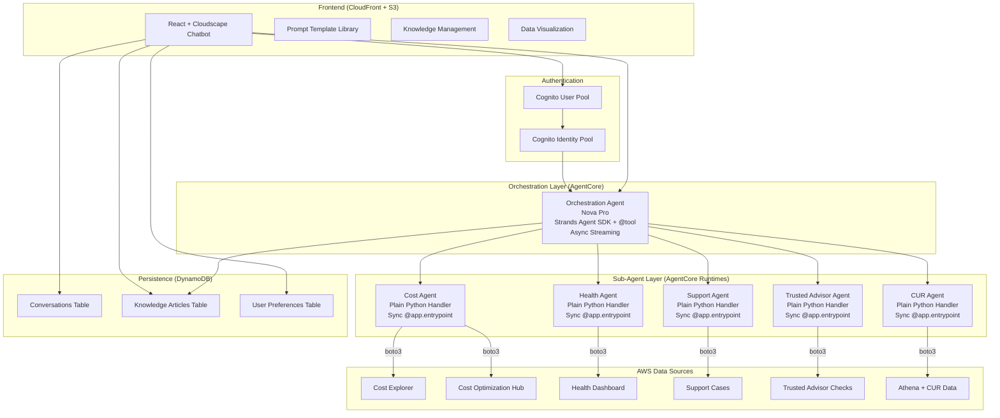
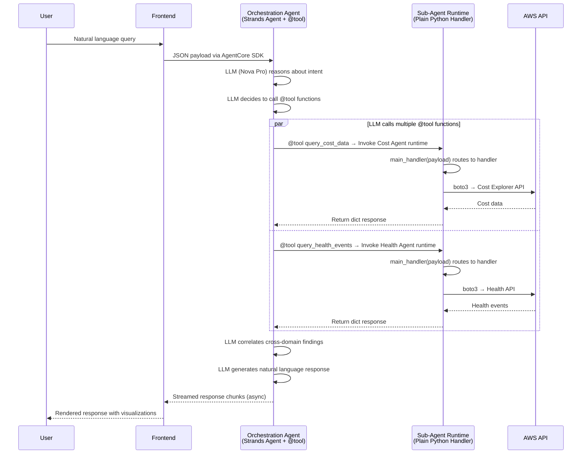
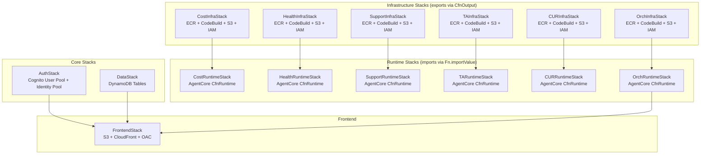

# G.O.A.T. Architecture

## Overview

G.O.A.T. uses a **hybrid multi-agent architecture** where each component uses the best approach for its role:

- The **Orchestration Agent** uses the Strands Agent SDK with Amazon Nova Pro on AgentCore. It takes natural language input, uses LLM reasoning to classify intent, invokes sub-agents via `@tool`-decorated functions, correlates cross-domain results, and streams natural language responses.
- The **Sub-Agents** (Cost, Health, Support, Trusted Advisor, CUR) are plain Python handlers using `BedrockAgentCoreApp` with synchronous `@app.entrypoint`. They receive structured JSON payloads, route to handler functions, and call AWS APIs directly via boto3.
- The **Frontend** is a React 18 + Cloudscape Design System chatbot with streaming chat, prompt templates, knowledge management, conversation history, and data visualization.
- **Infrastructure** is CDK TypeScript with modular stacks following the InfraStack → RuntimeStack import pattern via `cdk.Fn.importValue()`.

## High-Level Architecture

## Request Flow

The following diagram shows how a user query flows through the system. The orchestration agent uses LLM reasoning to decide which sub-agents to invoke, and can call multiple agents in parallel for cross-domain questions.

## CDK Stack Dependencies

The infrastructure uses a modular stack pattern where each domain has an InfraStack (creates resources, exports values) and a RuntimeStack (imports values, creates AgentCore runtime). This enables independent module deployment.

## Component Descriptions

### Orchestration Agent

| | |
|---|---|
| **Runtime** | AgentCore container with Strands Agent SDK |
| **Model** | Amazon Nova Pro (`global.amazon.nova-pro-v1:0`) |
| **Pattern** | Password-reset chatbot pattern — `Agent` + `@tool` + async streaming |

The orchestration agent is the brain of the system. It receives natural language queries from the frontend, uses Nova Pro's LLM reasoning to classify intent, and decides which sub-agents to invoke via `@tool`-decorated functions. Each `@tool` function invokes a sub-agent's AgentCore runtime via the AgentCore SDK.

Key capabilities:
- **Intent classification**: LLM naturally determines which domains are relevant
- **Parallel invocation**: Can call multiple sub-agents simultaneously for cross-domain queries
- **Cross-domain correlation**: Links findings across domains (e.g., Health event → cost anomaly)
- **Partial results**: If a sub-agent times out (30s), returns results from successful agents
- **Streaming**: Async response streaming for real-time frontend updates

Container dependencies: `strands-agents`, `strands-agents-bedrock`, `bedrock-agentcore`, `boto3`

### Cost Agent

| | |
|---|---|
| **Runtime** | AgentCore container with plain Python handler |
| **AWS APIs** | Cost Explorer, Cost Optimization Hub |
| **Handlers** | `handle_cost_and_usage`, `handle_cost_forecast`, `handle_recommendations` |

Queries cost and usage data, generates forecasts, and retrieves optimization recommendations. Validates time ranges (max 12 months) and formats responses with currency values, time ranges, and percentage changes.

### Health Agent

| | |
|---|---|
| **Runtime** | AgentCore container with plain Python handler |
| **AWS APIs** | AWS Health (global endpoint, us-east-1) |
| **Handlers** | `handle_describe_events`, `handle_affected_entities`, `handle_event_details` |

Retrieves Health Dashboard events filtered by region, service, and event type. Formats responses with event type, affected services, regions, start time, and status. Returns a confirmation message when no events match.

### Support Agent

| | |
|---|---|
| **Runtime** | AgentCore container with plain Python handler |
| **AWS APIs** | AWS Support |
| **Handlers** | `handle_describe_cases`, `handle_communications`, `handle_search_cases` |

Queries support cases with filtering by status and severity. Formats responses with case ID, subject, status, severity, and creation date. Returns a descriptive error if the account lacks an AWS Support plan.

### Trusted Advisor Agent

| | |
|---|---|
| **Runtime** | AgentCore container with plain Python handler |
| **AWS APIs** | Trusted Advisor |
| **Handlers** | `handle_describe_checks`, `handle_check_result`, `handle_list_recommendations` |

Retrieves Trusted Advisor checks and recommendations, categorized by pillar: cost_optimizing, security, performance, fault_tolerance, and service_limits. Returns a descriptive error if the account lacks the required support plan.

### CUR Agent

| | |
|---|---|
| **Runtime** | AgentCore container with plain Python handler |
| **AWS APIs** | Amazon Athena (querying CUR data in S3) |
| **Handlers** | `handle_query_cur`, `handle_resource_costs`, `handle_usage_patterns` |

Executes Athena queries against Cost and Usage Report data for granular resource-level cost analysis. Waits for query completion and returns formatted results. Returns a descriptive error if the CUR table is not configured.

### Frontend

| | |
|---|---|
| **Stack** | React 18 + Vite + Cloudscape Design System + TypeScript |
| **Hosting** | S3 + CloudFront with OAC |
| **Auth** | Cognito User Pool + Identity Pool |

| Component | Purpose |
|-----------|---------|
| `ChatInterface` | Streaming conversational UI with WebSocket/SSE |
| `PromptTemplatePanel` | Template library with 4 categories, parameterized fields |
| `KnowledgeManager` | Save, search, and export knowledge articles |
| `DataVisualization` | Tables, charts, cards based on data type detection |
| `ConversationHistory` | List and resume past conversations |
| `AccountSelector` | Cross-account target selection (optional) |
| `UserPreferences` | Theme, response format, default account settings |

### Persistence (DynamoDB)

| Table | Key Schema | Purpose |
|-------|-----------|---------|
| Conversations | PK: `USER#<userId>`, SK: `CONV#<id>` | Chat history with 90-day TTL archival |
| Knowledge Articles | PK: `ARTICLE#<id>`, GSI: `CATEGORY#<cat>` | Saved findings with search |
| User Preferences | PK: `USER#<userId>`, SK: `PREFS` | Display settings and defaults |

## Data Flow

### Query Processing

1. User types a natural language question in the chat interface
2. Frontend sends `{ "prompt": "..." }` to the orchestration agent via AgentCore SDK
3. Orchestration agent's LLM (Nova Pro) reasons about the query and decides which `@tool` functions to call
4. Each `@tool` function invokes the corresponding sub-agent's AgentCore runtime
5. Sub-agent's `main_handler` routes to the appropriate handler function based on the `action` field
6. Handler calls AWS APIs via boto3 and returns a structured response dict
7. Orchestration agent's LLM correlates results across domains and generates a natural language response
8. Response is streamed back to the frontend in real-time chunks
9. Frontend renders the response with appropriate visualizations (tables, charts, cards)

### Knowledge Management Flow

1. User saves a query response as a knowledge article (title, category, tags)
2. Article is stored in DynamoDB with structured metadata
3. When a new query is submitted, relevant knowledge articles are included as context
4. Articles can be searched by title, content, or tags with relevance ranking
5. Articles can be exported as JSON webhook payloads for external integration

### Conversation Persistence

1. Each conversation is stored per authenticated user in DynamoDB
2. Messages are ordered by timestamp within each conversation
3. Conversations inactive for 90+ days are automatically archived via TTL
4. Users can resume any active conversation from the history panel

## Deployment Modes

### Full Deployment
Deploys all stacks in dependency order:
1. **Core**: AuthStack, DataStack
2. **Infrastructure**: CostInfra, HealthInfra, SupportInfra, TAInfra, CURInfra, OrchInfra
3. **Runtime**: CostRuntime, HealthRuntime, SupportRuntime, TARuntime, CURRuntime, OrchRuntime
4. **Frontend**: FrontendStack (after retrieving stack outputs for configuration)

### Individual Module Deployment
Deploys only the selected domain's InfraStack + RuntimeStack pair, plus core stacks. Useful for testing a single domain or when you only need specific capabilities.

### Progressive Deployment
Start with one module and add more over time. Each module is independent — deploying a new module doesn't affect existing ones. When all desired modules are deployed, deploy the orchestration agent and frontend for the unified experience.

## Design Decisions

### Why Hybrid Agent Pattern?
The orchestration agent NEEDS LLM reasoning — it takes natural language, classifies intent, decides which agents to call, correlates results, and generates responses. Sub-agents DON'T need LLM reasoning — they receive structured JSON, call specific APIs, and return formatted data. Using plain Python handlers for sub-agents keeps containers lightweight and reduces cost.

### Why InfraStack → RuntimeStack Split?
Separating infrastructure creation (ECR, CodeBuild, S3, IAM) from runtime creation (AgentCore CfnRuntime) enables the modular deployment pattern. InfraStacks export values via `CfnOutput`/`exportName`, and RuntimeStacks import them via `cdk.Fn.importValue()`. This follows the proven lifecycle tracker pattern.

### Why BuildWaiterFunction?
Each RuntimeStack uses a custom Lambda that polls CodeBuild until the container image build completes. This ensures the AgentCore CfnRuntime is only created after the container image is available in ECR.

### Why Nova Pro + Nova Lite?
Nova Pro provides stronger reasoning for the orchestration agent's intent classification and cross-domain correlation. Nova Lite is cost-effective for sub-agents that perform simpler retrieve-and-format tasks.

### Why DynamoDB for All Persistence?
Conversations, knowledge articles, and user preferences all use DynamoDB for simplicity, serverless scaling, and built-in TTL support for conversation archival.
