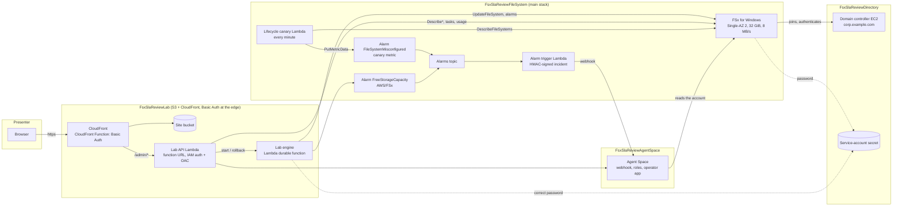

# Architecture: FSx for Windows SLA review with AWS DevOps Agent

The demo is derived from the capability, not from the environment: the
`storage-fsx-windows-sla-optimizer` skill reviews FSx for Windows file systems across seven
SLA dimensions, so the environment is the smallest file system that can be reviewed, plus the
directory it must join, plus the alarms the review looks for. Everything else is the Lab that
breaks it and the agent that reads it.

## Stacks

| Stack | Region | Contents | Why separate |
|---|---|---|---|
| `FsxSlaReviewAgentSpace-{agent-region}` | Agent Space region | Shared `DevOpsAgentSpace`: monitoring and operator roles, the Agent Space with operator app, the AWS monitor association, the eventChannel webhook (custom resource; HMAC secret written straight to Secrets Manager) | Deployed first; its outputs (space id, webhook URL, secret ARN) feed the others as `--context`. May live in another region than the file system: an Agent Space sees every region of the account |
| `FsxSlaReviewDirectory-{region}` | Deploy region | VPC 10.0.0.0/16, one AZ, public + private subnet, one NAT gateway; Windows Server 2022 domain controller (t3.medium, fixed IP 10.0.1.10, IMDSv2, no key pair, Session Manager); Secrets Manager secret `{"username":"FSxService","password":...}`; SSM parameter `/<project>/directory/ready` | FSx joins the domain at creation; the deploy script waits for this stack's controller to report ready before creating the file system |
| `FsxSlaReviewFileSystem-{region}` | Deploy region | The file system; SNS alarms topic; `FreeStorageCapacity` alarm (AWS/FSx, 20% floor); lifecycle canary Lambda on a one-minute schedule publishing `FileSystemMisconfigured`; its alarm; shared `AlarmTrigger` subscribed to the topic. Carries the solution tracking tag | The environment under review |
| `FsxSlaReviewLab-{region}` | Deploy region | Shared `LabEngine` (engine durable function + API function, one bundle, one role); Lambda function URL (IAM auth) behind CloudFront with origin access control; S3 site bucket; CloudFront Function for HTTP Basic authentication | The control room; can be redeployed alone (a new password, a UI change) |

## Data flows

**A review (Chat).** The presenter pastes the prompt in the Agent Space chat. The agent, with
the skill loaded, calls `fsx:DescribeFileSystems`, `fsx:DescribeBackups`,
`cloudwatch:GetMetricData` and `cloudwatch:DescribeAlarms` through the monitoring role, applies
the skill's finding logic and answers with the rated report. Nothing in the demo is involved
except the file system and its alarms.

**An injection.** `POST /admin/scenarios/{id}/inject` → the Lab API starts one durable
execution named `<scenario>-<epoch>` (idempotency key) → the engine runs the scenario's
`inject()` (an `UpdateFileSystem` or `DeleteAlarms` call), then waits for a callback with the
scenario's auto-revert timeout → `DELETE .../inject` resolves the callback, or the wait times
out → `revert()` runs. `GET /admin/status` reads the live file system and alarms (`probe()`)
and the execution history; nothing is stored.

**The incident.** The credentials scenario sends FSx a wrong password. FSx validates it against
the domain, fails, and moves the file system to `MISCONFIGURED` with
`ACTIVE_DIRECTORY_INVALID_CREDENTIALS`. The canary publishes `FileSystemMisconfigured = 1`, the
alarm fires, SNS notifies the trigger Lambda, which builds a generic incident (the alarm, the
file system id and domain as context lines) signed with the webhook HMAC secret and POSTs it to
the Agent Space webhook. The investigation starts with the skill loaded. The rollback restores
the correct password and waits for `AVAILABLE`; the canary publishes 0 and the alarm returns to
OK.

**The evaluation.** Run manually or weekly from the Agent Space; it consumes the investigations
the credentials scenario produced.

## Security model

- The domain controller has no public IP and no key pair; its security group admits traffic
  from inside the VPC only (a demo shortcut for the long Active Directory port list). Shell
  access is Session Manager through the NAT gateway. The service account is a Domain Admin
  (demo shortcut; the FSx documentation lists the delegated permissions to use instead).
- The service-account password is generated by Secrets Manager, read by the controller's user
  data and by the file system through a CloudFormation dynamic reference; it never appears in a
  template, a script or a log. The Lab reads it only to revert the credentials scenario.
- The Lab API is a Lambda function URL with IAM authentication that only CloudFront can call
  (origin access control signs the requests). Every viewer request, site or API, passes the
  CloudFront Function's HTTP Basic check first; the header is dropped before the origin so it
  never collides with the SigV4 signature. The credentials are embedded in the function code
  and therefore readable by anyone who can read the stack template: acceptable for a demo
  control room, not a production pattern.
- The Lab role is scoped to this file system (`fsx:UpdateFileSystem` on its ARN), this alarm
  (`PutMetricAlarm`/`DeleteAlarms` on its ARN), this secret, and read-only calls elsewhere. The
  Agent Space roles carry the AWS managed policies for the DevOps Agent.
- The webhook HMAC secret is returned once by `AssociateService`; the custom resource writes it
  to Secrets Manager and returns only the URL. The trigger Lambda reads it at run time.

## What is shared and what is this demo's

Mechanism, used as is from `shared/devops-agent/`: the Agent Space construct and its webhook
provisioner, the alarm trigger construct and its Lambda, the Lab engine (durable execution,
control plane, agent data-plane calls) and the `LabEngine` construct, the skill fetch script.

This demo's own: the environment (directory, file system, alarms, canary), `lab/scenarios.yaml`,
the three handlers, the Lab API routes and facts, the Lab site's wording, the deploy sequence
with its wait for the domain.
