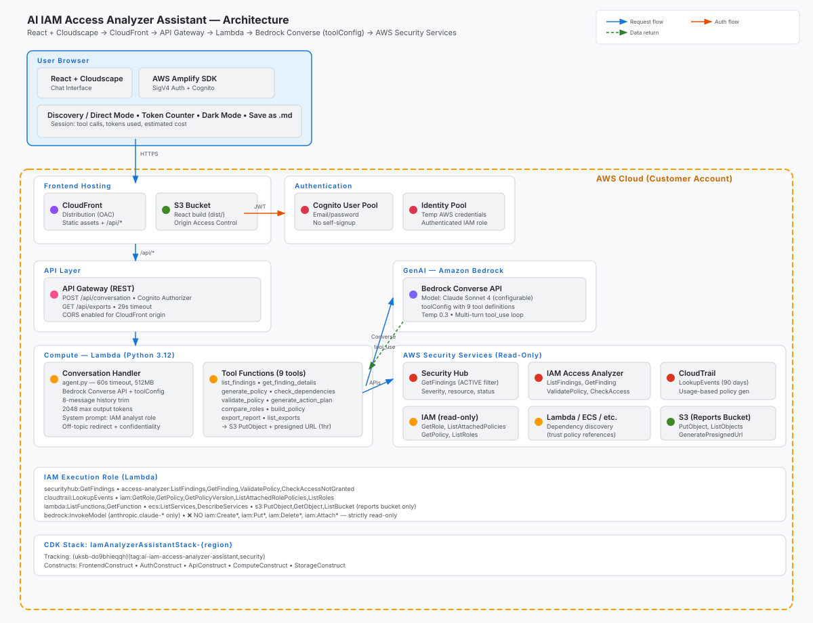

# AI IAM Access Analyzer Assistant
*Conversational least-privilege policy management powered by Amazon Bedrock*

## Overview

The AI IAM Access Analyzer Assistant provides a conversational interface for managing your AWS IAM security posture. Instead of navigating multiple console pages and writing JSON policies by hand, users ask natural language questions and receive actionable insights backed by IAM Access Analyzer findings, CloudTrail activity analysis, and policy validation.

## What's New

This release hardens the assistant for production use based on feedback from real deployments:

- **Signed download links are stable for a full hour.** A dedicated presigner IAM role signs S3 URLs with a session token that stays valid for the URL's entire lifetime, so previously-issued download links no longer expire early with an `InvalidToken` error when the Lambda's own STS token rotates in the background.
- **Common flows short-circuit deterministically.** Pagination (`next 10`, `page 3`), `generate an action plan`, `validate this policy` for a pasted JSON body, and the `generate an action plan and export it` compound now execute server-side in a single turn without a Bedrock round-trip. The model still handles novel or exploratory questions.
- **`list_findings` no longer blocks on large accounts.** The first page returns as soon as the API replies; the total finding count is scanned lazily (or not at all, per configuration). Accounts with tens of thousands of findings no longer time out on the very first user prompt.
- **Autonomous-agent scaffolding removed.** The standard build is now purely conversational; the experimental async-agent panel that shipped in an earlier variant has been retired to keep the codebase focused.

## At a Glance

- **Duration**: 15 minutes (deploy) + ongoing usage
- **Difficulty**: Intermediate
- **Target Audience**: Security engineers, cloud architects, DevOps teams
- **Key Technologies**: Amazon Bedrock (Claude), IAM Access Analyzer, Security Hub, CloudTrail, Lambda, API Gateway, Cognito, CloudFront
- **Estimated Cost**: $6-57/month depending on usage

## Business Value

- Reduces time to review IAM findings from hours to minutes
- Generates least-privilege policies automatically from CloudTrail data
- **Blast radius analysis** before any IAM change — shows exactly what would break
- Validates policies against security best practices before deployment
- Makes IAM security accessible to non-IAM-specialists through natural language

## What You Get

- A web-based chat interface for querying IAM security posture
- Automated least-privilege policy generation from CloudTrail analysis
- Blast radius analysis to understand impact before modifying or deleting IAM resources
- Policy validation against AWS best practices and IAM Access Analyzer
- Exportable policy documents in JSON, CDK (Python/TypeScript), and CloudFormation formats

### Exporting reports

Every generated artifact — policies, action plans, role comparisons, blast-radius analyses — is exportable to the reports S3 bucket with a signed download link valid for 1 hour. Files stay in S3 permanently, so an expired link is never a lost report:

- Ask `list my exports` to see everything that has been saved.
- Ask `get me a new link for <filename>` to mint a fresh 1-hour download link for any file.

The 1-hour lifetime is backed by a dedicated presigner IAM role the tool Lambdas assume specifically for URL signing; the URL remains valid for its full `X-Amz-Expires` window even if the Lambda's own STS credentials rotate underneath the request.

## How It Works

1. User asks a question in the chat interface (e.g., "What are my critical IAM findings?")
2. Request routes through CloudFront → API Gateway → Conversation Lambda
3. Lambda calls Amazon Bedrock Converse API with the user's message and tool definitions
4. Bedrock decides which tools to invoke (findings, policy generation, blast radius analysis, validation)
5. Tool Lambda functions query Security Hub, CloudTrail, and IAM APIs
6. Bedrock synthesizes tool results into a natural language response
7. Response displayed in the chat interface with formatted policies and findings

## Interactive Demo

Coming soon.

## Prerequisites

The stack deploys a read-only role and creates no security data of its own: the assistant reads what these services already hold **in the deployment region**. None of them is needed for the deployment to succeed, but without them the assistant has nothing to show, and the deploy script ends with a "Data sources" status telling you exactly what it will be able to see (see [Data sources status](#data-sources-status)).

- **Security Hub CSPM** — enabled in the deployment region. The IAM Access Analyzer integration turns on automatically when both services are enabled; all findings are read through Security Hub.
- **IAM Access Analyzer** — at least one active analyzer in the deployment region. The two kinds produce different findings, so pick by what you want the assistant to talk about:
  - *External access* (`ACCOUNT` or `ORGANIZATION`, free): public and cross-account access on S3, KMS, Lambda, SQS, Secrets Manager and IAM role trust policies.
  - *Unused access* (`ACCOUNT_UNUSED_ACCESS` or `ORGANIZATION_UNUSED_ACCESS`, billed per IAM role and user analyzed): unused roles, unused permissions, unused access keys and passwords. Most of the suggested prompts ("show my findings", "compare my unused roles", "blast radius of my most critical unused role") rely on this one.
- **CloudTrail** — nothing to configure. Policy generation reads the always-on 90-day management event history of the deployment region (`cloudtrail:LookupEvents`); a trail is not required.
- **Amazon Bedrock** — model access enabled for Claude (Anthropic)
- **AWS CLI** v2.31.13+
- **Node.js** 20+
- **Python** 3.10+
- **AWS CDK** (installed via npx, no global install required)

## Quick Start

### Linux/macOS

```bash
chmod +x deploy-all.sh
./deploy-all.sh
```

### Windows

```powershell
.\deploy-all.ps1
```

The script will:
1. Build the React frontend
2. Deploy the CDK stack through the shared `deploy-cdk` script (Lambda, API Gateway, Cognito, CloudFront, S3)
3. Configure the frontend with stack outputs
4. Upload the frontend to S3 and invalidate CloudFront
5. Create a demo Cognito user (`admin@example.com`) with a permanent password so you can sign in without going through the Amplify force-change-password flow.
6. Print the [Data sources status](#data-sources-status): what the assistant will be able to see in this region.

The final "Deployment Complete!" summary prints the CloudFront URL, the demo email, and the demo password — copy them from the terminal to sign in. Re-running the script rotates the demo user's password.

If a demo-user step fails, the script exits with a clear error rather than pretending the demo user was created; the CloudFormation deploy itself is already complete at that point and does not need to be re-run. To create additional users (teammates, service accounts, etc.), use the Cognito console against the printed User Pool ID, or the CLI equivalents:

```bash
aws cognito-idp admin-create-user \
  --user-pool-id <UserPoolId> --username you@example.com \
  --user-attributes Name=email_verified,Value=true --message-action SUPPRESS
aws cognito-idp admin-set-user-password \
  --user-pool-id <UserPoolId> --username you@example.com \
  --password '<strong-password>' --permanent
```

### Data sources status

The deploy script ends with a status block describing what the assistant can see in the deployment region. It never blocks the deployment; each line is one of three states: `[+]` present, `[!]` missing (with the command that fixes it), `[?]` could not be checked with your credentials.

```
 Data sources in us-east-1
   AWS Security Hub CSPM
     [+] Service                        enabled in us-east-1 since 2021-09-03
     [+] IAM Access Analyzer feed       on: IAM Access Analyzer findings are forwarded to Security Hub
     [+] Findings from Access Analyzer  1 active in Security Hub
   AWS IAM Access Analyzer
     [+] External access analyzer       ConsoleAnalyzer-… (ACCOUNT)
         Reports public and cross-account access on S3, KMS, Lambda, SQS, Secrets Manager and IAM role trust.
     [!] Unused access analyzer         none in us-east-1: unused roles and permissions cannot appear (most suggested prompts need this)
         aws accessanalyzer create-analyzer --analyzer-name unused-access --type ACCOUNT_UNUSED_ACCESS --configuration "unusedAccess={unusedAccessAge=90}" --region us-east-1
         (billed per IAM role and user analyzed)
   AWS CloudTrail
     [+] Event history                  90-day management event history of us-east-1 (always on, no trail required)
         Used by policy generation to see which API calls a role actually made.
```

In the example, the assistant will answer questions about the one cross-account finding but will report nothing for unused roles or permissions until an unused-access analyzer exists. New findings reach Security Hub within about 30 minutes of creating an analyzer.

## Architecture



For detailed architecture documentation, see [ARCHITECTURE.md](ARCHITECTURE.md).

```
User → CloudFront → S3 (React)
                  → API Gateway → Conversation Lambda → Bedrock Converse
                                                      → Tool Lambdas → Security Hub
                                                                     → CloudTrail
                                                                     → IAM
```

## What Gets Deployed

| Resource | Purpose |
|----------|---------|
| Cognito User Pool + Identity Pool | User authentication |
| API Gateway (REST) | Request routing with Cognito authorizer |
| Lambda (Conversation Handler) | Bedrock Converse orchestration |
| Lambda (list_findings) | Query Security Hub for IAM findings (paginated) |
| Lambda (get_finding_details) | Fetch the full context of a single finding |
| Lambda (generate_policy) | Analyze CloudTrail and generate least-privilege policies |
| Lambda (check_dependencies) | Blast radius analysis — map IAM entity dependencies |
| Lambda (validate_policy) | Validate policies via Access Analyzer |
| Lambda (generate_action_plan) | Turn a batch of findings into a prioritized remediation plan |
| Lambda (compare_roles) | Diff two IAM roles side-by-side |
| Lambda (export_report) | Persist a generated artifact to S3 and mint a signed download link |
| Lambda (list_exports) | List previously-exported artifacts and re-issue fresh download links |
| IAM Role (ToolExecutionRole) | Shared execution role for all tool Lambdas (read-only IAM, Security Hub, CloudTrail, Access Analyzer) |
| IAM Role (PresignerRole) | Assumed by tool Lambdas *only* to sign S3 download URLs. Read-only on the reports bucket, 1-hour session, so the URLs stay valid across Lambda credential rotation. |
| S3 (Frontend Hosting) | React app static files |
| S3 (Reports) | Generated policies and reports (optional — see note below) |
| CloudFront | HTTPS distribution for frontend |

**Note on S3 Reports Bucket**: The reports bucket stores exported artifacts (policies, change requests, action plans) for server-side access. If your organization restricts S3 bucket creation, you can remove the `StorageConstruct` from the CDK stack — the tool will gracefully fall back to local browser downloads via the "Save as .md" button. The frontend hosting bucket is required and cannot be removed.

**Using your own S3 bucket**: To point exports at an existing bucket instead of creating a new one:

1. Remove the `StorageConstruct` from `infrastructure/cdk/stacks/iam_analyzer_assistant_stack.py`
2. In `infrastructure/cdk/stacks/tools_construct.py`, replace `reports_bucket.bucket_name` with your bucket name in the Lambda environment variables:
   ```python
   "REPORTS_BUCKET": "your-existing-bucket-name",
   ```
3. Ensure the tool Lambda execution role has `s3:PutObject` and `s3:GetObject` on that bucket
4. Redeploy: `./deploy-all.sh`

## Configuration

Most tunables are set at CDK synth time in `infrastructure/cdk/stacks/tools_construct.py` (constructor arguments) and propagated to Lambdas as environment variables.

### Pagination on large accounts — `FULL_TOTAL_SCAN`

`list_findings` can either return a page of findings immediately (and let the total count settle later) or paginate through *every* finding on the first call to give an exact `total_matching` count. On an account with tens of thousands of findings the second mode makes even a "show me the first 10" request scale with the total count and can push the tool close to Lambda's 60-second timeout.

The behavior is controlled by the `FULL_TOTAL_SCAN` environment variable on the tool Lambdas, wired from a `full_total_scan` argument on `ToolsConstruct`:

| Value | Behavior | Response shape |
|-------|----------|----------------|
| `false` *(default in this stack)* | Return the first page immediately; if there are more findings, `total_matching` returns as `-1` (unknown) | Fast first paint on any account |
| `true` | Paginate through every finding to compute the exact total on the first call | Exact `total_matching`, at the cost of first-page latency scaling with account size |

To flip it on a smaller account where you always want an exact count, pass `full_total_scan=True` when instantiating `ToolsConstruct` (or set the env var directly on the tool Lambdas after deploy).

## Cost

| Resource | Monthly (Low) | Monthly (Active) |
|----------|---------------|------------------|
| Lambda (10 functions) | $1-3 | $5-15 |
| API Gateway | $1-2 | $3-5 |
| CloudFront + S3 | $1.50 | $3-7 |
| Cognito (< 50k MAU free) | $0 | $0 |
| Bedrock (Claude) | $2-5 | $10-30 |
| **Total** | **~$6-12** | **~$21-57** |

## Cleanup

```bash
# Bash
../../shared/scripts/deploy-cdk.sh --cdk-directory infrastructure/cdk --destroy --skip-bootstrap
```

```powershell
# PowerShell
& "..\..\shared\scripts\deploy-cdk.ps1" -CdkDirectory "infrastructure\cdk" -DestroyStack -SkipBootstrap
```

## Project Structure

```
ai-iam-access-analyzer-assistant/
├── README.md                        # This file
├── ARCHITECTURE.md                  # Technical architecture
├── STEERING.md                      # Press release + FAQ
├── deploy-all.ps1                   # PowerShell deployment
├── deploy-all.sh                    # Bash deployment
├── infrastructure/
│   └── cdk/
│       ├── app.py                   # CDK app entry point
│       ├── stacks/
│       │   ├── iam_analyzer_assistant_stack.py
│       │   ├── auth_construct.py
│       │   ├── api_construct.py
│       │   ├── tools_construct.py     # Tool Lambdas + presigner role
│       │   ├── storage_construct.py
│       │   └── frontend_construct.py
│       ├── requirements.txt
│       └── cdk.json
├── frontend/                        # React + Cloudscape chat UI
│   ├── src/
│   │   ├── App.tsx
│   │   ├── main.tsx
│   │   ├── components/
│   │   │   ├── ChatInterface.tsx
│   │   │   ├── MessageBubble.tsx
│   │   │   ├── PolicyViewer.tsx
│   │   │   ├── FindingsTable.tsx
│   │   │   ├── DependencyGraph.tsx
│   │   │   ├── WelcomeModal.tsx
│   │   │   └── ErrorBoundary.tsx
│   │   ├── services/
│   │   │   └── api.ts
│   │   └── types/
│   │       └── index.ts
│   ├── package.json
│   ├── vite.config.ts
│   └── index.html
├── src/                             # Backend Lambda code
│   ├── agent.py                     # Bedrock Converse orchestration + short-circuits
│   ├── tools/
│   │   ├── list_findings.py
│   │   ├── get_finding_details.py
│   │   ├── generate_policy.py
│   │   ├── check_dependencies.py
│   │   ├── validate_policy.py
│   │   ├── generate_action_plan.py
│   │   ├── compare_roles.py
│   │   ├── export_report.py
│   │   └── list_exports.py
│   └── requirements.txt
├── tests/                           # Local test harness
│   ├── test_tools_local.py
│   ├── test_conversation_local.py
│   ├── test_list_findings.py
│   ├── test_pagination_shortcircuit.py
│   ├── test_action_plan_shortcircuit.py
│   ├── test_validate_and_export_shortcircuits.py
│   └── test_export_report_clients.py
└── .gitignore
```

## Example Conversation

Here's what a real interaction looks like:

```
You: What are my active IAM findings?

Assistant: I found 20 active findings from IAM Access Analyzer. All are MEDIUM severity
         for unused IAM roles. Here are some notable ones:

         1. EpoxyAccessRole — unused since creation (July 22, 2026)
         2. ConsoleAdminAccess — cross-account role, never used
         3. ApolloRole — 8 permissions granted, 0 used in 90 days
         ...

         Would you like me to check dependencies for any of these before deletion?

You: Check dependencies for ConsoleAdminAccess

Assistant: Dependency Analysis for ConsoleAdminAccess:

         Risk Level: LOW (Score: 0/100)
         Direct Dependents: None
         Trust: arn:aws:iam::123456789012:root (with ExternalId condition)
         Policies Attached: None

         Recommendation: Safe to delete. No resources depend on this role,
         and the cross-account access hasn't been used.

You: Generate a least-privilege policy for ApolloRole

Assistant: Policy Analysis for ApolloRole:

         Current: 8 actions granted (autoscaling, ec2, elasticloadbalancing)
         Used: 0 actions in 90 days
         Reduction: 100%

         This role has not made a single API call in 90 days.
         Recommendation: Delete the role entirely, or apply an empty policy
         and monitor for 30 days before deletion.
```

## Customization

### Identity & Authentication (Production Use)

The default deployment creates a standalone Cognito User Pool with a demo user — suitable for evaluation and demos. For production use, integrate with your existing identity provider:

**Option 1: Cognito + SAML Federation (Okta, Azure AD, Ping)**

```python
# In auth_construct.py, add a SAML identity provider:
saml_provider = cognito.UserPoolIdentityProviderSaml(
    self, "SAMLProvider",
    user_pool=self.user_pool,
    metadata=cognito.UserPoolIdentityProviderSamlMetadata.url(
        "https://your-idp.example.com/metadata.xml"
    ),
    name="CorporateSSO",
    attribute_mapping=cognito.AttributeMapping(
        email=cognito.ProviderAttribute.other("email"),
        fullname=cognito.ProviderAttribute.other("name"),
    ),
)
```

**Option 2: Cognito + OIDC Federation (Auth0, Keycloak, Google Workspace)**

```python
oidc_provider = cognito.UserPoolIdentityProviderOidc(
    self, "OIDCProvider",
    user_pool=self.user_pool,
    client_id="your-oidc-client-id",
    client_secret="your-oidc-client-secret",
    issuer_url="https://your-idp.example.com",
    name="CorporateOIDC",
)
```

**Option 3: AWS IAM Identity Center (SSO)**

For organizations using IAM Identity Center, replace the Cognito authorizer with IAM auth and use Identity Center to federate access to the API.

**Production security hardening:**

- Disable self-signup: set `self_sign_up_enabled=False`
- Require MFA: add `mfa=cognito.Mfa.REQUIRED`
- Set shorter token lifetimes in the app client
- Restrict sign-in to federated users only (disable password auth)
- Add a custom domain to the Cognito User Pool
- Enable advanced security features (adaptive authentication, compromised credential protection)

### Change the Model

Edit `infrastructure/cdk/stacks/api_construct.py` or set the environment variable:

```python
# In api_construct.py, change the BEDROCK_MODEL_ID value:
"BEDROCK_MODEL_ID": "us.anthropic.claude-haiku-4-5-20251001-v1:0",  # Cheaper, faster
"BEDROCK_MODEL_ID": "us.anthropic.claude-sonnet-4-5-20250929-v1:0", # Default (balanced)
"BEDROCK_MODEL_ID": "us.anthropic.claude-opus-4-1-20250805-v1:0",   # Most capable
```

### Add a New Tool

1. Create `src/tools/your_tool.py` with a `handler(event, context)` function
2. Add a Lambda function in `infrastructure/cdk/stacks/tools_construct.py`
3. Add the function name env var in `infrastructure/cdk/stacks/api_construct.py`
4. Add the tool to `TOOL_FUNCTIONS` and `TOOL_CONFIG` in `src/agent.py`

Example tool structure:

```python
# src/tools/list_roles_by_age.py
import boto3

def handler(event, context=None):
    days_unused = event.get("days_unused", 90)
    iam = boto3.client("iam")
    # ... your logic here
    return {"roles": [...], "count": N}
```

### Modify the System Prompt

Edit `SYSTEM_PROMPT` in `src/agent.py` to change the assistant's personality, focus areas, or response style:

```python
SYSTEM_PROMPT = """You are a security compliance auditor focused on PCI-DSS.
Only analyze findings related to payment card data environments..."""
```

### Add Conversation Persistence

To persist conversations across sessions, add a DynamoDB table:

1. Add a `DynamoDB.Table` in the CDK stack
2. Store conversation history keyed by Cognito user ID
3. Load history on `GET /conversations`
4. Append messages on each `POST /conversation`

### Customize the Frontend

The frontend uses [Cloudscape Design System](https://cloudscape.design/). Key files:

- `frontend/src/components/ChatInterface.tsx` — chat layout and input handling
- `frontend/src/components/MessageBubble.tsx` — message rendering with structured data detection
- `frontend/src/components/PolicyViewer.tsx` — code/policy display with copy button
- `frontend/src/components/FindingsTable.tsx` — tabular findings display
- `frontend/src/components/DependencyGraph.tsx` — dependency visualization

## Troubleshooting

### "Invalid identity pool configuration"

**Cause:** The Identity Pool doesn't have IAM roles attached.
**Fix:** Remove `identityPoolId` from the Amplify config in `App.tsx`. The frontend uses JWT-based auth via API Gateway Cognito Authorizer — no Identity Pool needed.

### "Access denied" from SCP on Bedrock

**Cause:** Organization SCPs may restrict Bedrock to specific regions, but cross-region inference profiles route to multiple regions.
**Fix:** Add `"bedrock:*"` to the `NotAction` list in your region-restriction SCP from the management account:

```bash
aws organizations update-policy --policy-id <YOUR_SCP_ID> --content '...'
```

### "The provided model identifier is invalid"

**Cause:** Newer Claude models require cross-region inference profiles, not direct model IDs.
**Fix:** Use the `us.` prefix format:

```bash
# List available inference profiles:
aws bedrock list-inference-profiles --query "inferenceProfileSummaries[?contains(inferenceProfileId, 'claude')].inferenceProfileId" --output text

# Use one like: us.anthropic.claude-sonnet-4-5-20250929-v1:0
```

### "Model marked as Legacy"

**Cause:** Bedrock deactivates models unused for 30+ days.
**Fix:** Use a newer model. Check available inference profiles (see above).

### CDK "No module named 'aws_cdk'"

**Cause:** `cdk.json` synthesizes with `python3 app.py`; the CDK deps were installed into a different interpreter (or not at all).
**Fix:** Install them into the Python that `python3` resolves to (the shared deploy script does this and verifies the import):

```bash
python3 -m pip install -r infrastructure/cdk/requirements.txt
```

### CDK deploy fails on bootstrap (missing SSM parameter / stale bootstrap stack)

**Cause:** The target account/region isn't bootstrapped for CDK, or has an outdated/partial bootstrap. This is common in accounts managed by a landing zone, where the bootstrap stack may have been created with custom permission boundaries or qualifiers.
**Fix:** Bootstrap the environment before deploying:

```bash
npx cdk bootstrap aws://<account-id>/<region>
```

If your organization requires a permissions boundary or a custom qualifier on the bootstrap stack, pass it explicitly, for example:

```bash
npx cdk bootstrap aws://<account-id>/<region> \
  --custom-permissions-boundary <boundary-policy-name>
```

See the [AWS CDK bootstrapping guide](https://docs.aws.amazon.com/cdk/v2/guide/bootstrapping.html) for options specific to managed/enterprise accounts.

### "Password does not conform to policy" in Cognito UI

**Cause:** Amplify Authenticator force-change-password screen has quirks.
**Fix:** Set a permanent password via CLI to skip the force-change flow:

```bash
aws cognito-idp admin-set-user-password \
  --user-pool-id <POOL_ID> \
  --username your@email.com \
  --password 'YourPassword123' \
  --permanent
```

### Lambda timeout on generate_policy

**Cause:** CloudTrail lookback over large time ranges can be slow.
**Fix:** The generate_policy Lambda has a 120s timeout. For roles with heavy API activity, reduce lookback_days (ask "Generate a policy for role X with 30 day lookback").

### "Failed to fetch" on complex requests

**Symptom:** You see "Failed to fetch" when asking the assistant to do multiple things in one message (e.g., "list my findings and export them to S3").

**Cause:** API Gateway has a 29-second timeout. Requests that require multiple sequential tool calls (e.g., query findings → process results → export to S3) can exceed this limit, especially in longer conversations.

**Update:** Several common compound requests are now handled server-side in a single turn without a Bedrock round-trip, so they no longer time out:

- Pagination: `next 10`, `page 3`, `show more`
- `generate an action plan`
- `generate an action plan and export it`
- `validate this policy` when the message contains a pasted policy JSON body

**Workaround for other multi-step requests:** Break them into separate messages:

1. First: "Show me my top findings"
2. Then: "Export that to S3"

Single-tool requests work reliably. The export tool works correctly as a standalone follow-up.

### Frontend shows blank page

**Cause:** CloudFront serving stale cache after redeployment.
**Fix:** Invalidate the cache:

```bash
aws cloudfront create-invalidation --distribution-id <DIST_ID> --paths "/*"
```

### No findings returned

**Cause:** Security Hub CSPM not enabled in the deployment region, no active analyzer there, or an analyzer of the other kind (an external-access analyzer produces no unused-role findings, and vice versa).
**Fix:** Re-run `deploy-all` and read the [Data sources status](#data-sources-status) block at the end; it names what is missing and prints the command that creates it. To check by hand in the deployment region:

```bash
aws securityhub describe-hub
aws accessanalyzer list-analyzers --query "analyzers[?status=='ACTIVE'].[type,name]" --output table
aws securityhub get-findings --filters '{"ProductName":[{"Value":"IAM Access Analyzer","Comparison":"EQUALS"}],"RecordState":[{"Value":"ACTIVE","Comparison":"EQUALS"}]}' --max-results 1
```

### "Failed to fetch" or empty responses after extended session

**Symptom**: The assistant returns errors or blank responses after working correctly earlier. The browser console may show 401/403 or "Failed to fetch" errors.

**Cause**: Your Cognito session token has expired. Cognito access tokens expire after 1 hour by default.

**Fix**:

1. Refresh the browser page (F5) — this re-authenticates with Cognito
2. If the issue persists, sign out and sign back in
3. For long demo sessions, ensure your AWS CLI credentials are still valid: `aws sts get-caller-identity`

**Note**: If you're using temporary credentials (SSO, assumed roles), ensure they haven't expired. The Lambda functions use their own execution role, but an expired session can affect the initial authentication flow.

## Production Considerations

If adopting this tool beyond demo/evaluation, consider the following:

### Cost Management

- **Per-message visibility**: The UI shows token usage and estimated cost per session. For budget enforcement, add CloudWatch alarms on the Bedrock `InvocationCount` metric.
- **Usage caps**: Implement API Gateway usage plans with per-user daily/monthly request limits.
- **Model selection**: Switch to a lighter model (Claude Haiku) for routine queries; reserve Sonnet for complex analysis.
- **Budget alerts**: Set AWS Budgets alerts on the Bedrock service to notify when spend exceeds thresholds.

### Scope Control

- The assistant is configured to redirect off-topic questions back to IAM security. However, determined users can still generate general responses. For stricter enforcement:
  - Add a pre-processing Lambda that classifies intent before invoking Bedrock (cheap keyword/embedding check)
  - Implement request logging and periodic audit of question topics
  - Consider API Gateway WAF rules to block clearly abusive patterns

### Operational Hardening

| Area | Demo Default | Production Recommendation |
|------|-------------|--------------------------|
| Auth | Cognito User Pool + demo user | SAML/OIDC federation with corporate IdP |
| MFA | Disabled | Required (TOTP or hardware key) |
| Session | 1 hour token lifetime | 15-30 minutes for sensitive environments |
| Logging | CloudWatch only | CloudTrail data events + S3 access logging |
| Encryption | SSE-S3 | SSE-KMS with customer-managed key |
| Network | Public CloudFront | CloudFront + WAF + geo-restriction |
| Throttling | None | API Gateway usage plans per user |
| Audit | None | Log all queries + tool results to S3 for compliance |

### Data Residency

- Bedrock cross-region inference profiles may route requests to multiple AWS regions. If data residency requirements exist, use a single-region model ID instead of `us.` prefixed profiles.
- Generated policies and reports stored in S3 inherit the bucket's region. For compliance, ensure the S3 bucket is in an approved region.

## Contributing

We welcome community contributions! Please see [CONTRIBUTING.md](../../CONTRIBUTING.md) for guidelines.

## Security

See [CONTRIBUTING](../../CONTRIBUTING.md#security-issue-notifications) for more information.

## License

This library is licensed under the MIT-0 License. See the [LICENSE](../../LICENSE) file.
